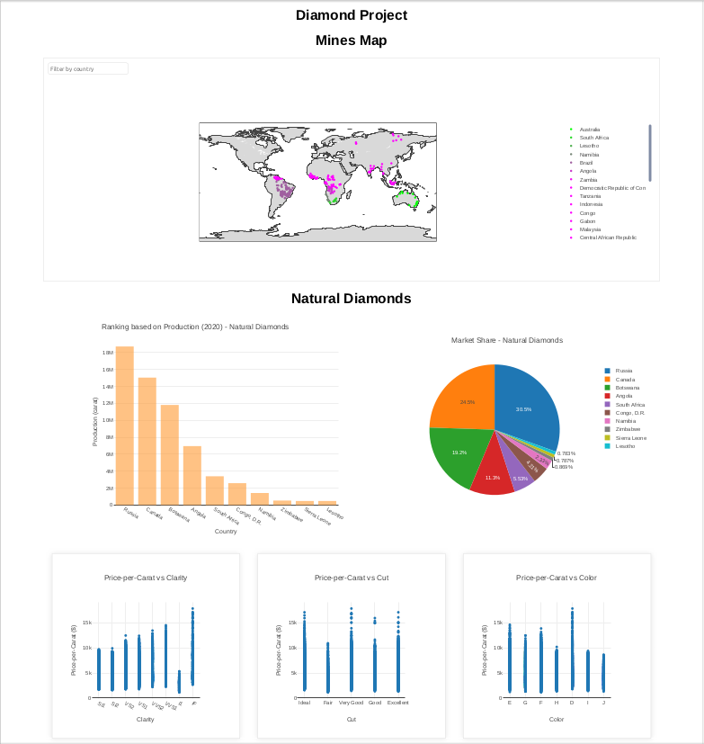

### Diamonds Analysis (Natural vs Lab-grown)

This project involves collecting, cleaning, and analyzing data related to natural and lab-grown diamonds, creating interactive visualizations using Plotly, and developing a user-friendly dashboard with Flask as the backend for deployment. This type of project can be valuable for stakeholders in the diamond industry, researchers, or anyone interested in understanding the differences between natural and lab-grown diamonds.


Install required libraries and run code file

```pip install -r requirements.txt```


```python3 Flask_Database.py```



